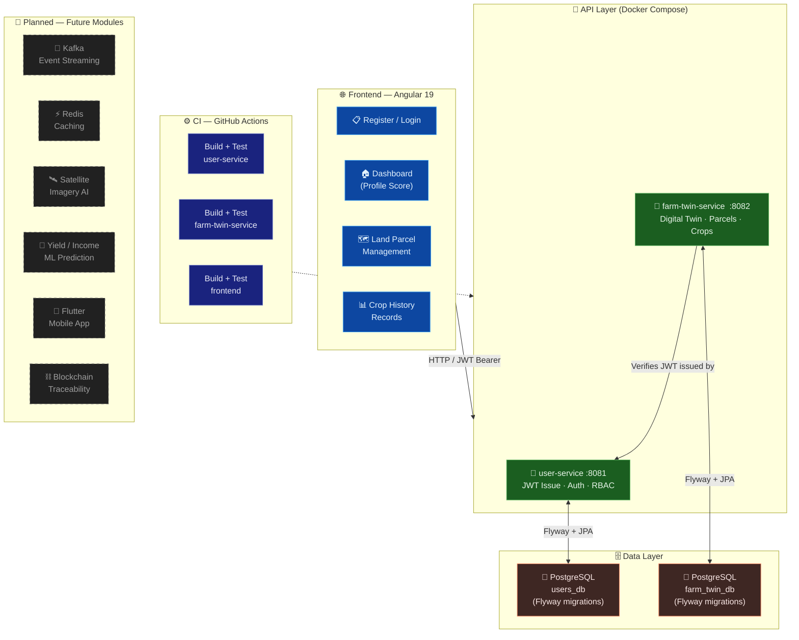

<div align="center">

# 🌾 AGRI-TWIN AI

**Farm Commodity Digital Twin — India's Smallholder Farmer Intelligence Platform**

[](https://docs.oracle.com/en/java/javase/21/)
[](https://docs.spring.io/spring-boot/docs/3.2.x/reference/html/)
[](https://angular.dev/overview)
[](https://www.postgresql.org/docs/16/)
[](https://docs.docker.com/)
[](https://docs.github.com/en/actions)

> A Farm Commodity Digital Twin platform for Indian smallholder farmers, cooperatives, and agri-enterprise buyers —
> predicts yield, income, and risk using real-time IoT, satellite imagery, and AI.

[](https://github.com/ravigithubcse/agri-twin)
[](docs/MODULE_1_COMPLETION.md)
[](docs/ROADMAP.md)

</div>

---

## 🏗️ Architecture



**Request Flow (Module 1 — what is actually built):**
1. **Angular 19 SPA** (standalone components + Signals + Angular Material) serves register, login, dashboard, and land parcel management
2. All requests carry a **JWT Bearer token** — issued exclusively by `user-service`, verified by both services
3. **user-service** (:8081) handles registration, login, JWT access + refresh token lifecycle, logout, and profile lookup — backed by its own PostgreSQL database with Flyway migrations
4. **farm-twin-service** (:8082) manages one Farm Digital Twin per user, land parcels, and crop history records — enforces ownership on every query, verifies JWTs but never issues them
5. Both services run together via **Docker Compose** against real PostgreSQL databases with a single `docker compose up --build`
6. **GitHub Actions CI** builds and runs tests for all three components on every push to any branch
7. **Future modules** (greyed out) will add Kafka event streaming, Redis caching, satellite imagery AI, ML yield/income prediction, Flutter mobile, and blockchain traceability — sequenced by infrastructure and data availability

---

## ✅ What Is Built (Module 1)

| Component | Status | Details |
|-----------|--------|---------|
| `user-service` | ✅ Done | Registration · Login · JWT access + refresh tokens · Logout · Profile |
| `farm-twin-service` | ✅ Done | Farm Digital Twin · Land parcels · Crop history · Ownership RBAC |
| `frontend` | ✅ Done | Angular 19 · Standalone components · Signals · Dashboard · Profile score |
| Docker Compose | ✅ Done | Full backend stack with real PostgreSQL — single command local dev |
| GitHub Actions CI | ✅ Done | Build + test all services on every push |

## 🔮 What Is Planned (Future Modules)

| Feature | Module | Dependency |
|---------|--------|-----------|
| Apache Kafka event streaming | 2 | Managed Kafka cluster |
| Redis caching layer | 2 | Managed Redis instance |
| AI/ML yield & income prediction | 3 | Real farm datasets + satellite imagery |
| Flutter mobile app | 3 | Core API stability |
| Blockchain traceability | 4 | Managed blockchain infra |
| Aadhaar / govt data integration | 4 | Regulatory approval |
| Razorpay billing | 5 | Business registration |
| Satellite imagery processing | 3 | ISRO / Planet Labs API access |

---

## 📁 Repository Layout

```
agri-twin/
├── backend/
│   ├── user-service/          # Auth · Identity · RBAC
│   └── farm-twin-service/     # Farm Digital Twin · Land Parcels · Crop History
├── frontend/                  # Angular 19 web app
├── docker/                    # docker-compose.yml + .env.example
├── docs/                      # Module completion reports · Roadmap · API docs
└── .github/workflows/         # CI — backend & frontend
```

---

## 🚀 Running Locally

### Backend (requires Docker)

```bash
cd docker
cp .env.example .env    # edit JWT_SECRET to any strong secret
docker compose up --build
```

| Service | URL | Swagger |
|---------|-----|---------|
| user-service | http://localhost:8081 | http://localhost:8081/swagger-ui.html |
| farm-twin-service | http://localhost:8082 | http://localhost:8082/swagger-ui.html |

### Frontend

```bash
cd frontend
npm install
npm start   # → http://localhost:4200  (backend must be running)
```

### Tests

```bash
# Backend services
cd backend && mvn -pl user-service -am verify
cd backend && mvn -pl farm-twin-service -am verify

# Frontend
cd frontend && npm test
```

---

## 🛠️ Tech Stack

| Layer | Technologies |
|-------|-------------|
| **Backend** | Java 21 · Spring Boot 3 · Spring Security 6 · Spring Data JPA · Flyway |
| **Frontend** | Angular 19 · Standalone Components · Signals · Angular Material · TypeScript |
| **Database** | PostgreSQL (per service) · Flyway migrations |
| **Auth** | JWT access tokens + refresh tokens · RBAC ownership enforcement |
| **DevOps** | Docker · Docker Compose · GitHub Actions CI |
| **Planned** | Apache Kafka · Redis · PyTorch · FastAPI · Flutter · Neo4j · Pinecone |

---

<div align="center">

*Built by **Ravikumar** — Bengaluru, India 🇮🇳 · Ravi Future Labs*

[](https://github.com/ravigithubcse/agri-twin)

</div>
