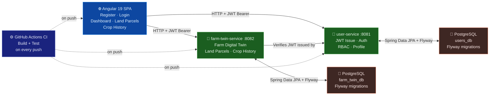

<div align="center">

# 🌾 AGRI-TWIN AI

**Farm Commodity Digital Twin — India's Smallholder Farmer Intelligence Platform**

[](https://docs.oracle.com/en/java/javase/21/)
[](https://docs.spring.io/spring-boot/docs/3.2.x/reference/html/)
[](https://angular.dev/overview)
[](https://www.postgresql.org/docs/16/)
[](https://docs.docker.com/)
[](https://docs.github.com/en/actions)

> A Farm Commodity Digital Twin platform for Indian smallholder farmers, cooperatives, and agri-enterprise buyers.
> **Module 1 (this repo, today):** identity, auth, and farm/land/crop record-keeping.
> Real-time IoT, satellite imagery, and AI yield prediction are part of the long-term
> product vision (see Roadmap) but are **not implemented yet** — nothing below should be
> read as claiming otherwise.

[](https://github.com/ravigithubcse/agri-twin)
[](docs/MODULE_1_COMPLETION.md)
[](docs/ROADMAP.md)

</div>

---

## 🏗️ Architecture



> **Planned future modules** (not yet built): Apache Kafka · Redis · Satellite Imagery AI · ML Yield Prediction · Flutter Mobile · Blockchain Traceability · Aadhaar Integration · Razorpay Billing

**Request Flow:**
1. **Angular 19 SPA** (standalone components + Signals + Angular Material) — register, login, dashboard, land parcel management
2. Every request carries a **JWT Bearer token** — issued by `user-service`, verified by both services
3. **user-service** (:8081) handles registration, login, JWT access + refresh tokens, logout, and profile — own PostgreSQL + Flyway
4. **farm-twin-service** (:8082) manages one Farm Digital Twin per user, land parcels, and crop history — verifies JWTs but never issues them — own PostgreSQL + Flyway
5. **Docker Compose** brings both services + both databases up with a single `docker compose up --build`
6. **GitHub Actions CI** builds and tests all 3 components on every push — currently green

## ✅ What Is Built (Module 1)

| Component | Status | Details |
|-----------|--------|---------|
| `user-service` | ✅ Verified | Registration · Login · JWT access + refresh tokens · Logout · Profile — passes CI |
| `farm-twin-service` | ✅ Verified | Farm Digital Twin · Land parcels · Crop history · Ownership RBAC — passes CI |
| `frontend` | ✅ Verified | Angular 19 · Standalone components · Signals · Dashboard · Profile score — builds clean |
| Docker Compose | ✅ Done | Full backend stack with real PostgreSQL — single command local dev |
| GitHub Actions CI | ✅ Green | Both backend services and the frontend pass automated build + test on every push |

> **Verification note:** as of commit `05086c4`, both backend services and the frontend
> pass their full CI suites (`mvn verify` per service, `ng build` + Karma tests for the
> frontend) — see the [Actions tab](../../actions) for the live status badge and history.
> This module went through three real CI failures during development (a Spring Security
> 401-vs-403 default, an unhandled exception being silently swallowed, and an unnamed
> `@PathVariable` relying on a compiler flag that wasn't set) before going green — all are
> documented in the commit history for anyone curious how they were diagnosed and fixed.

## 🔮 What Is Planned (Future Modules)

| Feature | Module | Dependency |
|---------|--------|-----------|
| Apache Kafka event streaming | 2 | Managed Kafka cluster |
| Redis caching layer | 2 | Managed Redis instance |
| AI/ML yield & income prediction | 3 | Real farm datasets + satellite imagery |
| Flutter mobile app | 3 | Core API stability |
| Blockchain traceability | 4 | Managed blockchain infra |
| Aadhaar / govt data integration | 4 | Regulatory approval |
| Razorpay billing | 5 | Business registration |
| Satellite imagery processing | 3 | ISRO / Planet Labs API access |

---

## 📁 Repository Layout

```
agri-twin/
├── backend/
│   ├── user-service/          # Auth · Identity · RBAC
│   └── farm-twin-service/     # Farm Digital Twin · Land Parcels · Crop History
├── frontend/                  # Angular 19 web app
├── docker/                    # docker-compose.yml + .env.example
├── docs/                      # Module completion reports · Roadmap · API docs
└── .github/workflows/         # CI — backend & frontend
```

---

## 📡 API Reference (Module 1)

**user-service** (`:8081`)

| Method | Path | Auth | Purpose |
|---|---|---|---|
| POST | `/api/v1/auth/register` | No | Register, returns access + refresh tokens |
| POST | `/api/v1/auth/login` | No | Authenticate, returns access + refresh tokens |
| POST | `/api/v1/auth/refresh` | No (refresh token in body) | Exchange refresh token for new access token |
| POST | `/api/v1/auth/logout` | Yes | Revoke all refresh tokens for the caller |
| GET | `/api/v1/users/me` | Yes | Get the authenticated user's profile |

**farm-twin-service** (`:8082`)

| Method | Path | Auth | Purpose |
|---|---|---|---|
| POST / GET | `/api/v1/farm-twins/me` | Yes | Create / get the caller's farm twin |
| POST / GET | `/api/v1/farm-twins/me/land-parcels` | Yes | Add / list land parcels |
| GET | `/api/v1/farm-twins/me/land-parcels/{id}` | Yes | Get one land parcel |
| POST / GET | `/api/v1/farm-twins/me/land-parcels/{id}/crop-history` | Yes | Add / list crop history for a parcel |
| GET | `/api/v1/farm-twins/me/land-parcels/{id}/crop-history/{cropId}` | Yes | Get one crop history record |

"Auth" = `Authorization: Bearer <accessToken>` header, issued by user-service.

---

## 🚀 Running Locally

### Backend (requires Docker)

```bash
cd docker
cp .env.example .env    # edit JWT_SECRET to any strong secret
docker compose up --build
```

| Service | URL | Swagger |
|---------|-----|---------|
| user-service | http://localhost:8081 | http://localhost:8081/swagger-ui.html |
| farm-twin-service | http://localhost:8082 | http://localhost:8082/swagger-ui.html |

### Frontend

```bash
cd frontend
npm install
npm start   # → http://localhost:4200  (backend must be running)
```

### Tests

```bash
# Backend services
cd backend && mvn -pl user-service -am verify
cd backend && mvn -pl farm-twin-service -am verify

# Frontend
cd frontend && npm test
```

---

## 🛠️ Tech Stack

| Layer | Technologies |
|-------|-------------|
| **Backend** | Java 21 · Spring Boot 3 · Spring Security 6 · Spring Data JPA · Flyway |
| **Frontend** | Angular 19 · Standalone Components · Signals · Angular Material · TypeScript |
| **Database** | PostgreSQL (per service) · Flyway migrations |
| **Auth** | JWT access tokens + refresh tokens · RBAC ownership enforcement |
| **DevOps** | Docker · Docker Compose · GitHub Actions CI |
| **Planned** | Apache Kafka · Redis · PyTorch · FastAPI · Flutter · Neo4j · Pinecone |


---

## 🎬 Architecture Animation Script

A Python script to generate a **60-second MP4 walkthrough video** of the full Agri-Twin architecture — scene by scene with animated data-flow arrows, colour-coded layers, and explanatory captions.

```bash
# Install dependencies
pip install matplotlib numpy pillow

# Run the generator
python scripts/agri_twin_architecture_animation.py

# Output: agri_twin_architecture.mp4  (~60 sec · 1920×1080 · 30fps)
```

**Scenes covered:**
1. 🎬 Title card — tech stack overview
2. 📐 Full architecture — all 6 components across 4 layers
3. 🌐 Angular 19 SPA — standalone components, Signals, AuthInterceptor
4. 🔐 Auth flow — Register → BCrypt → JWT → RefreshToken → logout
5. 🌿 Farm-Twin Service — Digital Twin lifecycle, Land Parcels, Crop History APIs
6. 🗄️ PostgreSQL Schema — all 5 tables with columns and constraints
7. 🐳 Docker Compose + GitHub Actions CI — startup order, health checks, test runs
8. 🔮 Roadmap — Kafka, Redis, ML, Flutter, Blockchain

> Requires `ffmpeg` for MP4 output. Falls back to animated GIF if FFmpeg is not installed.

---

---

## 🎬 Architecture Animation Script

A Python script to generate a **60-second MP4 walkthrough video** of the full Agri-Twin architecture — animated data-flow arrows, colour-coded layers, and explanatory captions across 8 scenes.

```bash
# Install dependencies
pip install matplotlib numpy pillow

# Run the generator
python scripts/agri_twin_architecture_animation.py

# Output: agri_twin_architecture.mp4  (~60 sec · 1920×1080 · 30fps)
```

**Scenes covered:**
1. 🎬 Title card — tech stack overview
2. 📐 Full architecture — all 6 components across 4 layers
3. 🌐 Angular 19 SPA — standalone components, Signals, AuthInterceptor
4. 🔐 Auth flow — Register → BCrypt → JWT access token → Refresh token → Logout
5. 🌿 Farm-Twin Service — Digital Twin lifecycle, Land Parcels, Crop History APIs
6. 🗄️ PostgreSQL Schema — all 5 tables with columns and constraints
7. 🐳 Docker Compose + GitHub Actions CI — startup order, health checks, test runs
8. 🔮 Roadmap — Kafka, Redis, ML Prediction, Flutter, Blockchain

> Requires `ffmpeg` for MP4. Falls back to animated GIF if FFmpeg is not installed.

---

## 👤 Author

<div align="center">

| | |
|---|---|
| **Name** | Ravikumar (Ravi) |
| **Company** | Ravi Future Labs |
| **Location** | Bengaluru, India 🇮🇳 |
| **Email** | [rn5127610@gmail.com](mailto:rn5127610@gmail.com) |
| **Phone** | [+91 96869 06521](tel:+919686906521) |
| **LinkedIn** | [linkedin.com/in/ravikumar2002](https://www.linkedin.com/in/ravikumar2002/) |
| **GitHub** | [github.com/ravigithubcse](https://github.com/ravigithubcse) |

[](https://www.linkedin.com/in/ravikumar2002/)
[](https://github.com/ravigithubcse/agri-twin)
[](mailto:rn5127610@gmail.com)
[](https://github.com/ravigithubcse/agri-twin)

*Building India's Farmer Intelligence Platform — Ravi Future Labs*

</div>
